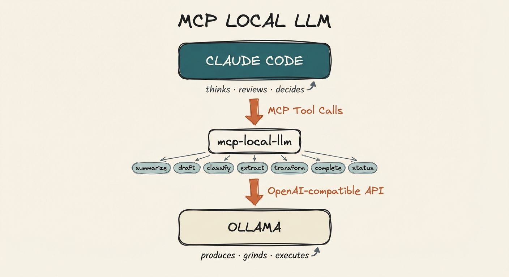

# mcp-local-llm

MCP server that lets Claude Code delegate mechanical tasks to a local LLM. Claude does the thinking; your local model handles the grunt work — summarization, classification, extraction, drafting.

This is **not** a replacement for Claude. It's a cost-optimization layer. Claude stays in control, decides what to delegate, and reviews the output. The local model just does volume work that doesn't need frontier reasoning.

## Architecture



Claude Code sits at the top as the orchestrator. It calls mcp-local-llm tools via MCP, which forward requests to Ollama (or any OpenAI-compatible backend) running locally. Claude decides what to delegate and reviews what comes back.

## Requirements

- [Ollama](https://ollama.com/) installed and running
- Node.js 18+
- Claude Code (or any MCP-compatible client)

## Setup

### 1. Install Ollama and pull a model

```bash
# Install Ollama (macOS)
brew install ollama

# Start the Ollama service
ollama serve

# Pull the default model
ollama pull qwen2.5-coder:7b
```

### 2. Clone and build

```bash
git clone https://github.com/aplaceforallmystuff/mcp-local-llm.git
cd mcp-local-llm
npm install
npm run build
```

### 3. Add to Claude Code

```bash
claude mcp add local-llm -s user -- node /path/to/mcp-local-llm/dist/index.js
```

Or add manually to `~/.claude.json`:

```json
{
  "mcpServers": {
    "local-llm": {
      "command": "node",
      "args": ["/path/to/mcp-local-llm/dist/index.js"]
    }
  }
}
```

### 4. Verify

In Claude Code, the `local_status` tool should show your Ollama connection and available models.

## Available Tools

### `local_summarize`
Summarize text using the local LLM.

**Parameters:**
- `text` (required): Text to summarize
- `style`: `"brief"` | `"detailed"` | `"bullet_points"` | `"executive"`
- `max_length`: Approximate max words (default: 150)
- `focus`: Specific aspect to emphasize

**Use for:** Bulk summarization, condensing research, meeting notes

### `local_draft`
Generate initial drafts for refinement.

**Parameters:**
- `task` (required): What to draft
- `context` (required): Context and requirements
- `format`: Output format (markdown, plain text, etc.)
- `tone`: Desired tone (professional, casual, technical)

**Use for:** Boilerplate, initial content, template-based generation

### `local_classify`
Classify text into categories.

**Parameters:**
- `text` (required): Text to classify
- `categories` (required): Array of possible categories
- `allow_multiple`: Allow multiple categories (default: false)
- `explain`: Include explanation (default: false)

**Use for:** Sorting, tagging, organizing content

### `local_extract`
Extract structured information from text.

**Parameters:**
- `text` (required): Text to extract from
- `fields` (required): Array of fields to extract
- `output_format`: `"json"` | `"yaml"` | `"markdown_table"`

**Use for:** Parsing documents, data extraction

### `local_transform`
Transform text according to instructions.

**Parameters:**
- `text` (required): Text to transform
- `instruction` (required): Transformation instructions

**Use for:** Formatting, style conversion, simple rewrites

### `local_complete`
Raw completion for maximum flexibility.

**Parameters:**
- `prompt` (required): The prompt
- `system`: System message
- `max_tokens`: Max tokens (default: 2048)
- `temperature`: Temperature (default: 0.7)

**Use for:** Custom tasks that don't fit other tools

### `local_status`
Check local LLM connection status and available models.

## Configuration

Environment variables (all optional — defaults work with a standard Ollama install):

| Variable | Default | Description |
|----------|---------|-------------|
| `LOCAL_LLM_BASE_URL` | `http://localhost:11434/v1` | Ollama API endpoint |
| `LOCAL_LLM_MODEL` | `qwen2.5-coder:7b` | Model to use |
| `LOCAL_LLM_MAX_TOKENS` | `2048` | Default max tokens |
| `LOCAL_LLM_TEMPERATURE` | `0.7` | Default temperature |

### Alternative: Docker Model Runner

If you prefer Docker Model Runner over Ollama:

```bash
# Enable Model Runner with TCP access
docker desktop enable model-runner --tcp=12434

# Pull a model
docker model pull ai/gemma3:latest
```

Then set the environment variables:

```bash
export LOCAL_LLM_BASE_URL="http://localhost:12434/engines/v1"
export LOCAL_LLM_MODEL="ai/gemma3:latest"
```

Any backend that exposes an OpenAI-compatible API will work.

## Delegation Philosophy

| Claude Does | Local Model Does |
|-------------|------------------|
| Complex reasoning | Bulk summarization |
| Architecture decisions | Boilerplate generation |
| Quality review | Text extraction/formatting |
| Novel problem solving | Simple classification |
| Final editing | Initial draft generation |

Claude reviews, local model produces. The local model handles volume; Claude handles quality control.

## Teaching Claude to Delegate

Once the MCP server is running, Claude Code can call these tools automatically. But Claude won't know *when* to use them unless you tell it. Here's how to set that up.

### Option 1: Add routing instructions to CLAUDE.md

The most reliable approach. Add delegation rules to your project or global `CLAUDE.md` file so Claude applies them every session:

```markdown
## Local LLM Routing

Route mechanical tasks to local models via `mcp__local-llm__*` tools to save API costs.

| Task Type | Tool | Example |
|-----------|------|---------|
| Summarizing content | `local_summarize` | Condensing research notes |
| Initial drafts | `local_draft` | Boilerplate emails, docstrings |
| Classification | `local_classify` | Sorting items, tagging content |
| Data extraction | `local_extract` | Parsing structured data from text |
| Text transformation | `local_transform` | Formatting changes, style conversions |
| Custom simple tasks | `local_complete` | Any mechanical task with clear instructions |

### When NOT to Route Locally

- Complex reasoning or analysis
- Security-sensitive operations
- Tasks requiring multi-step tool chains
- Content requiring voice/style judgment
- Anything you specifically want Claude's opinion on
```

### Option 2: Ask Claude directly

You can tell Claude to delegate in conversation:

```
"Summarize these 20 files using the local model"
"Use local_classify to sort these inbox items into categories: work, personal, spam"
"Draft a README section using local_draft, then review and clean it up yourself"
```

Claude will call the MCP tools and review the output before presenting it to you.

### Option 3: Build it into custom agents

If you use Claude Code's agent system, add delegation instructions to agent definitions:

```markdown
## Agent: inbox-processor

When classifying inbox items, use `local_classify` to categorize each item
before deciding where to file it. Use `local_summarize` to create brief
descriptions for items that need them.
```

### Practical Examples

**Batch summarize research files:**
```
"Read all the markdown files in ./research/ and use local_summarize to create
a bullet-point summary of each one. Compile the summaries into a single document."
```

**Classify and sort content:**
```
"I have 30 notes in my inbox folder. Use local_classify with categories
[project, reference, action-item, archive] to sort them, then move each
file to the appropriate folder."
```

**Draft-then-refine workflow:**
```
"Use local_draft to generate initial docstrings for all exported functions
in src/. Then review each one and fix anything that's inaccurate or unclear."
```

**Extract structured data:**
```
"Extract the name, email, company, and role from each of these email signatures
using local_extract. Output as a JSON array."
```

The pattern is always the same: local model produces, Claude reviews. You get the cost savings of a 7B model for volume work, with Claude's judgment as the quality gate.

## Troubleshooting

**"Connection refused" or status shows error**
- Check Ollama is running: `ollama list`
- Start it if needed: `ollama serve`
- Verify the port: `curl http://localhost:11434/v1/models`

**"Model not found"**
- Pull the model: `ollama pull qwen2.5-coder:7b`
- Or set a different model via `LOCAL_LLM_MODEL`

**Using a different backend**
- Set `LOCAL_LLM_BASE_URL` to your backend's OpenAI-compatible endpoint
- Set `LOCAL_LLM_MODEL` to a model your backend supports

**Tools not appearing in Claude Code**
- Verify the MCP server is configured: `claude mcp list`
- Check the path to `dist/index.js` is correct
- Rebuild if needed: `npm run build`

## License

MIT
